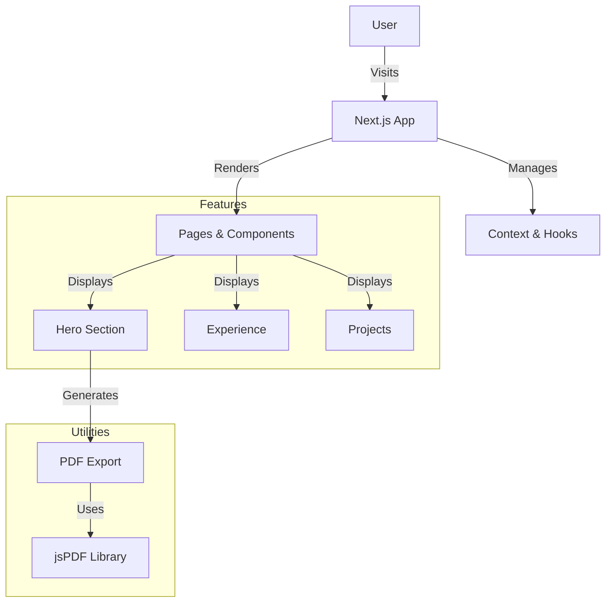

# Nyi Nyi Zaw - Portfolio


A modern, responsive portfolio built with performance and design in mind.

[**🚀 Live Demo**](https://nyinyizaw.vercel.app/)

## ✨ Features

*   **🎨 Modern UI**: Clean, responsive design with dark/light mode.
*   **📄 PDF Resume**: Auto-generated professional PDF resume.
*   **⚡ High Performance**: Built on Next.js App Router.
*   **📱 Responsive**: Optimized for all devices.

## 🛠 Tech Stack

| Category | Technologies |
|----------|--------------|
| **Core** | Next.js 14, TypeScript, React 18 |
| **Styling** | Tailwind CSS, Framer Motion, Lucide Icons |
| **Utils** | jsPDF, html2canvas, zod |
| **DevOps** | Vercel, ESLint, Prettier |

## 🏗 Architecture



## 📂 Project Structure

```
src/
├── app/              # App Router pages & layout
├── components/       # Reusable UI components
├── data/             # Static content (Resume data)
├── lib/              # Utilities (PDF generation, animations)
└── context/          # React Context (Resume state)
```

## 🚀 Getting Started

```bash
# 1. Clone
git clone https://github.com/nyinyiz/resume.git

# 2. Install
npm install

# 3. Run
npm run dev
```

## 📞 Contact

[](https://linkedin.com/in/nyinyiz)
[](https://github.com/nyinyiz)
[](mailto:nyinyizaw.dev@gmail.com)
